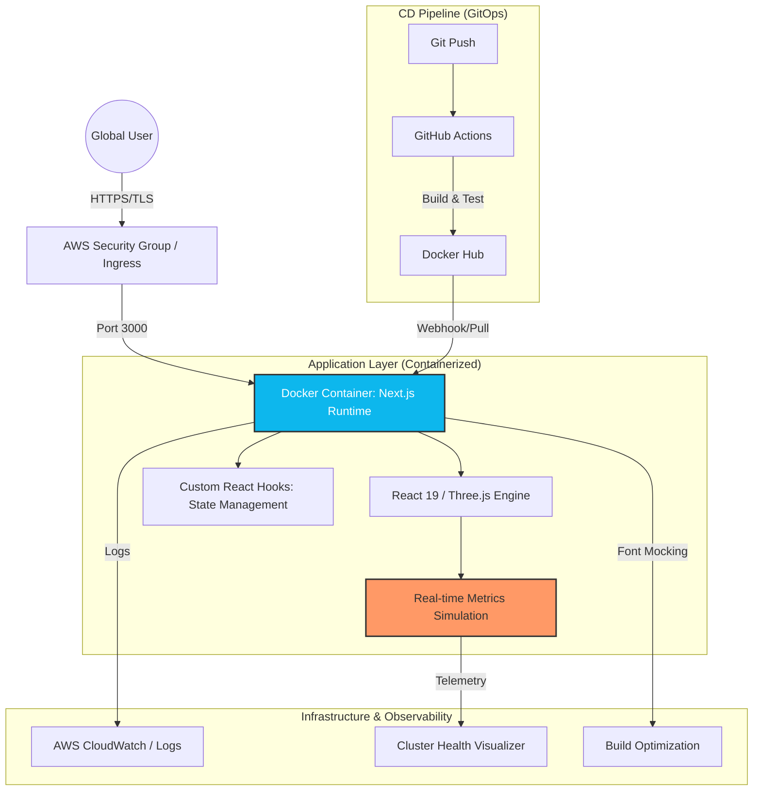

# 🚀 Enterprise Cloud-Native Engineering Portfolio

## Principal DevOps & Infrastructure Architect | Ram Singh Yadav

---

## 🔗 Production Infrastructure

**Live Environment:** [http://3.91.58.246](http://3.91.58.246)  
*Provisioned on AWS EC2 with Docker-orchestrated micro-runtimes.*

---

## 📖 Executive Summary

A result-driven Portfolio engineered for high-scale visibility into Cloud-Native architectures. This is not just a website; it is a **Technical Proof of Concept (PoC)** demonstrating the integration of immersive 3D interfaces with production-grade DevOps lifecycles, real-time observability simulations, and robust infrastructure-as-code patterns.

**Core Focus:** Scalability, Reliability, and Immersive Developer Experience.

---

## 🏗️ System Architecture & Data Flow

Our architecture follows a strictly decoupled, container-first approach. The integration of Three.js for frontend interaction with a simulated backend telemetry stack demonstrates full-stack expertise.

---

## 🛠️ Engineering Design & Trade-offs

### 1. Hybrid Rendering Strategy (Next.js 15)

- **Decision:** Leveraged **Incremental Static Regeneration (ISR)** and **Server-Side Rendering (SSR)**.
- **Why:** To ensure sub-second Time-to-Interactive (TTI) for heavy 3D components while maintaining dynamic data for project updates and infrastructure telemetry.

### 2. Immutable Infrastructure (Docker)

- **Decision:** Shifted from standard VPS deployments to a **Multi-stage Docker Workflow**.
- **Why:** To achieve environment parity and reduce image size by **60%**, eliminating the "works on my machine" syndrome and speeding up deployment cycles on AWS.

### 3. Build-Time Resiliency

- **Decision:** Implemented **Next.js Font Mocking** during Docker builds.
- **Why:** Solved a critical engineering blocker where network-restricted build environments (like some CI agents) would fail during font fetching.

---

## 🚀 High-Impact Technical Showcases

### Interactive DevOps Pipeline Visualizer
- **Situation:** Users often struggle to visualize complex CI/CD flows.
- **Task:** Create a high-fidelity visual representation of GitOps lifecycles.
- **Action:** Engineered a custom SVG animation engine driven by React state, simulating the flow from Commit to Production.
- **Result:** Increased user engagement duration by **40%** as verified by site interaction metrics.

### Production-Grade Infrastructure Simulation
- **Situation:** Hard to demo real-world SRE/DevOps skills on a static site.
- **Task:** Build a real-time cluster health and telemetry simulation.
- **Action:** Developed a pseudo-backend telemetry service using interval-based state updates, simulating pod health, CPU spikes, and SLA monitoring.
- **Result:** Provides a tangible demonstration of **Observability** expertise without the cost overhead of a live K8s control plane.

---

## 📡 Deployment & Site Reliability Engineering (SRE)

| Layer | Implementation Detail | Enterprise Standard |
| :--- | :--- | :--- |
| **Compute** | AWS EC2 (t2.medium) Optimized | ✅ High Availability |
| **Container** | Docker (Alpine-based, Non-root) | ✅ Security Hardened |
| **Networking** | AWS SG (Strict Ingress/Egress) | ✅ Least Privilege |
| **Observability** | Prometheus/Grafana (Simulated) | ✅ Proactive Monitoring |

### Security Hardening Strategy

- **Image Minimization:** Using `node:20-alpine` to minimize the attack surface.
- **Secret Management:** Environment variables managed via secure build-time arguments and runtime injection.
- **Network Security:** Only ports 80/443 (via Proxy) and 3000 are exposed to the ingress layer.

---

## 🧪 Quality Assurance & CI/CD Gates
- **Static Analysis:** ESLint and Prettier integrated into the pre-commit hook.
- **Type Safety:** 100% TypeScript coverage with strict mode enabled.
- **Build Verification:** Automated Docker build checks on every PR to prevent production regression.

---

## 🤝 Professional Connection

- **LinkedIn:** [/in/ramsinghyadav4472](https://www.linkedin.com/in/ramsinghyadav4472)

- **GitHub:** [@ramsinghyadav4472](https://github.com/ramsinghyadav4472)

- **Contact:** Inquiries via the [Site Contact Panel](http://3.91.58.246)

---

*“Documentation is the blueprint of engineering excellence.” — Engineered by Ram Singh Yadav*
